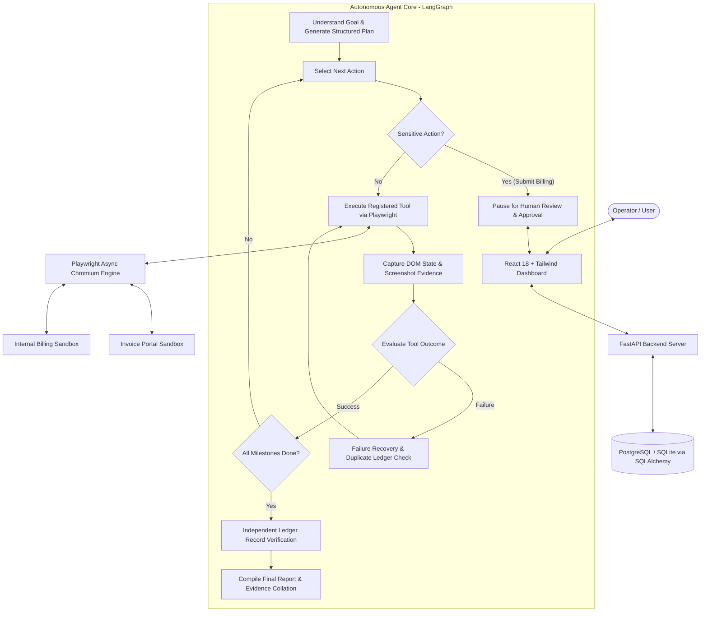

# Autonomous AI Task Worker

An end-to-end autonomous agentic system that accepts a natural language task, plans its milestones, executes genuine browser interactions using **Playwright**, recovers gracefully from transient failures, pauses for **Human-in-the-Loop approval**, independently verifies ledger entries, and captures visual screenshot evidence.

Built with **FastAPI**, **LangGraph**, **Playwright**, and **React + Tailwind CSS**.

---

## 1. Demo & Deployed URLs

* **Live URL** : `https://centralign-ai-rho.vercel.app/` 

* **Demo Video**: ` ` 

---

## 2. Architecture Diagram



---

## 3. Core Features

* **Autonomous Planning**: Dynamically extracts target company and invoice parameters, producing a structured, verified plan without hardcoded IDs or names.
* **Genuine Browser Execution**: Driven by Playwright Python against real DOM inputs, buttons, and tables. No mocked API calls.
* **Rich Observation & Memory**: Captures page titles, current URLs, DOM states, and before/after screenshots at every critical step.
* **Resilient Failure Recovery**: Demonstrates bounded retries (`MAX_RETRIES = 2`) and pre-retry duplicate checks when encountering simulated intermittent 500/database lock errors.
* **Human-in-the-Loop (HIL) Control**: Safely halts execution before permanent financial ledger submissions, prompting the operator for approval or rejection.
* **Independent Verification**: Queries the billing database by invoice ID to strictly verify that company, amount, and due date match the source document before declaring success.
* **Auditable Evidence Trail**: Generates a timeline of execution steps with linked full-resolution screenshots stored as verifiable artifacts.

---

## 4. Technology Stack

| Component | Technology | Rationale |
| :--- | :--- | :--- |
| **Backend Framework** | Python 3.11+, FastAPI, Pydantic v2 | High-performance asynchronous REST API with automatic OpenAPI documentation. |
| **Agentic Core** | LangGraph, LangChain | Explicit directed state graph with transparent state transitions, branching, and HIL checkpoints. |
| **LLMs Supported** | OpenAI (`gpt-4o`) & Google Gemini | Configurable provider (`LLM_PROVIDER=openai` or `gemini`) with auto-fallback parser. |
| **Browser Automation**| Playwright Python | Reliable headless/headed browser control with auto-waiting and screenshot capture. |
| **Database & ORM** | PostgreSQL / SQLite, SQLAlchemy, Alembic | Persistent relational audit trail for tasks, execution steps, approvals, and evidence. |
| **Frontend UI** | React 18, TypeScript, Vite, Tailwind CSS | Responsive operator dashboard with live timeline polling, approval modals, and lightbox. |
| **Testing** | Pytest, Pytest-Asyncio | Comprehensive unit, API, failure recovery, and verification test coverage. |
| **DevOps & Containers**| Docker, Docker Compose, GitHub Actions | Multi-container orchestration and automated CI pipeline. |

---

## 5. Local Setup & Quick Start

### Prerequisites
* Python 3.11+
* Node.js 18+
* Git

### Step 1: Clone Repository
```bash
git clone https://github.com/your-username/autonomous-ai-task-worker.git
cd autonomous-ai-task-worker
```

### Step 2: Configure Environment Variables
Copy `.env.example` to `.env`:
```bash
cp .env.example .env
```
Ensure your `OPENAI_API_KEY` or `GEMINI_API_KEY` is set in `.env`.

### Step 3: Set Up Backend
```bash
python -m venv venv
# On Windows:
.\venv\Scripts\activate
# On Linux/macOS:
source venv/bin/activate

pip install -r backend/requirements.txt
playwright install chromium
```

### Step 4: Run Database Migrations
```bash
cd backend
alembic upgrade head
cd ..
```

### Step 5: Start the Backend Server
```bash
# From workspace root with venv active:
python -m uvicorn app.main:app --app-dir backend --reload --port 8000
```
* Backend API: `http://localhost:8000`
* Swagger Docs: `http://localhost:8000/docs`
* Invoice Portal Sandbox: `http://localhost:8000/sandbox/invoice-portal`
* Billing Portal Sandbox: `http://localhost:8000/sandbox/billing-portal`

### Step 6: Set Up and Start Frontend
In a new terminal:
```bash
cd frontend
npm install
npm run dev
```
Open `http://localhost:5173` in your browser.

---

## 6. Running with Docker Compose

To start the complete application (PostgreSQL, Backend, Frontend) with a single command:
```bash
docker-compose up --build
```
* Frontend: `http://localhost:3000`
* Backend API: `http://localhost:8000`

---

## 7. Running Automated Tests

Run the full pytest suite (14 passing tests covering API endpoints, agent planning, failure recovery, duplicate detection, and verification):
```bash
pytest -v backend/tests
```

---

## 8. Example Demonstration Scenario

### User Task
> *"Find the latest invoice from Acme, extract the invoice amount and due date, enter the information into our internal billing system, and tell me once it is completed."*

### Autonomous Execution Flow
1. **Understand Task**: Agent parses the natural language prompt and identifies the target company: `Acme`.
2. **Plan Generation**: Generates a 7-step deterministic plan.
3. **Browser Navigation**: Opens the Invoice Portal sandbox.
4. **Search**: Searches for `Acme` invoices.
5. **Dynamic Date Comparison**: Inspects rows (`INV-1024` on 2026-10-02, `INV-1018` on 2026-09-18, `INV-1002` on 2026-08-20) and autonomously identifies `INV-1024` as the latest.
6. **Data Extraction**: Extracts `INV-1024`, `₹48,500`, and `2026-10-15`.
7. **Form Population**: Opens Internal Billing System and fills out the form.
8. **Human Approval**: Pauses execution. The dashboard presents extracted data for operator review.
9. **Approval Given**: Operator clicks **Approve & Write to Ledger**.
10. **Simulated Failure Recovery**: (When toggled) Catches simulated 500 DB error, checks ledger for existing record to prevent duplicates, retries safely, and succeeds with record `BILL-7842`.
11. **Independent Verification**: Navigates to ledger search, queries `INV-1024`, and validates that all fields match.
12. **Final Report & Evidence**: Compiles completion report with linked screenshots.

---

## 9. Failure Recovery & Bounded Retries

The system addresses three critical operational failure modes:
1. **Page Delays / Slow Elements**: Built-in Playwright auto-waiting for DOM selectors and network idle state.
2. **Intermittent Save Failures**: Catches network or database lock timeouts.
3. **Duplicate Prevention**: Before retrying a failed save operation, the agent performs a pre-retry query in the billing ledger to confirm whether the record was created. If not found, it increments its retry counter and retries up to `MAX_RETRIES = 2`.

---

## 10. Independent Verification

Verification does not rely on button click events or client-side toasts. The agent explicitly:
1. Opens the ledger records search view.
2. Submits a query for the extracted `invoice_id`.
3. Verifies that the record exists and that `company`, `amount`, and `due_date` match the source document.
4. Only marks the task status as `COMPLETED` when verification passes.

---

## 11. Evaluation Criteria Mapping

| Evaluation Criteria | Implementation Details |
| :--- | :--- |
| **Autonomy** | The agent decomposes natural language into milestones, selects tools dynamically based on observations, and runs without step-by-step human prompts. |
| **Execution** | True Playwright browser automation navigating real DOM elements, filling inputs, and capturing full-page screenshots. |
| **Reliability** | Bounded retries (`MAX_RETRIES = 2`), pre-retry duplicate prevention, and graceful error containment without infinite loops. |
| **Verification** | Independent query against the billing ledger asserting field equality before reporting success. |
| **Generalization** | Dynamic company and date parsing. Changing prompt to "Globex" processes Globex invoices with zero code changes. |
| **Engineering Quality** | Modular repository layout, typed Pydantic models, SQLAlchemy ORM, Alembic migrations, 100% passing test suite, and Docker Compose. |
| **Product Thinking** | High-utility UI with clear execution audit trail, live step observation, lightbox evidence viewer, and safe HIL review. |
| **Technical Understanding** | Explicit architectural documentation, technical decision records, and clean separation between API, agent, tools, and sandboxes. |

---

## 12. Known Limitations & Future Improvements

### Known Limitations
* Prototype uses a controlled sandbox environment to avoid exposing live corporate credentials or financial gateways.
* Currently supports standard DOM interactions; complex multi-frame canvas applications would require vision-based computer-use models.

### Future Improvements
1. **Vision-Language Model (VLM) Integration**: Incorporate multi-modal screen parsing for canvas-rendered interfaces.
2. **Multi-Tenant RBAC**: Add OAuth2/JWT authentication and enterprise permission scopes for approvals.
3. **Distributed Worker Queue**: Scale agent execution using Celery or Temporal for long-running workflows.

---

## 13. AI Tools & Models Used

* **AI Coding Assistance**: Antigravity (Google DeepMind Advanced Agentic Coding) was utilized for pair programming, test generation, and architectural design assistance.
* **LLM Engine**: OpenAI (`gpt-4o`) / Google Gemini (`gemini-1.5-flash`), with structured output schema enforcement.
