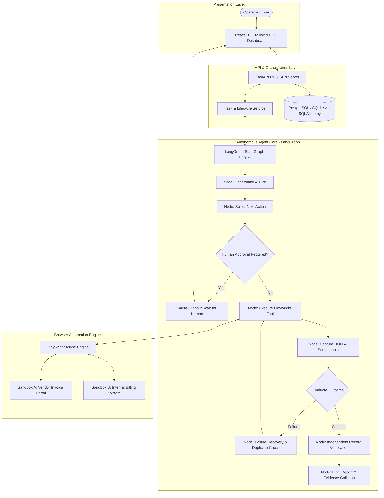

# System Architecture: Autonomous AI Task Worker

## 1. High-Level Architecture Overview

The **Autonomous AI Task Worker** is an agentic, production-grade automation system designed to execute multi-step browser workflows against enterprise web applications without relying on fragile hardcoded selectors, mock APIs, or blind command execution.

---

## 2. Agent Workflow & LangGraph State Machine

The agent is modeled as an explicit directed state machine using `LangGraph`:

1. **`understand_and_plan`**: 
   - Dynamically parses the target company name, invoice criteria, and end goal using structured LLM output (with fallback parser for deterministic reliability).
   - Generates an ordered execution plan with explicit actions.
2. **`select_next_action`**:
   - Inspects the current milestone index and previous observations.
   - Evaluates whether the pending action requires human approval before proceeding.
3. **`await_approval`**:
   - For sensitive ledger mutations (`submit_billing_record`), checkpoints the graph state and marks task as `AWAITING_APPROVAL`.
   - Halts execution until the operator approves or rejects via the dashboard or API.
4. **`execute_tool`**:
   - Invokes only registered Playwright browser tools (`open_invoice_portal`, `search_company_invoices`, `extract_latest_invoice`, `open_billing_portal`, `fill_billing_form`, `submit_billing_record`, `verify_billing_record`).
   - Disallows arbitrary code or shell execution.
5. **`observe_and_evaluate`**:
   - Queries page title, current URL, error banners, and success confirmation.
   - Captures high-resolution full-page screenshot evidence.
6. **`failure_recovery`**:
   - Detects failures (such as intermittent HTTP 500 or DB lock acquisition timeouts).
   - **Pre-retry Duplicate Check**: Inspects billing records first to confirm whether the record was created despite the error signal.
   - If not created and retries remain (`retry_count < MAX_RETRIES`), safely retries.
   - If maximum retries are exceeded, gracefully fails without infinite loops.
7. **`verify_billing_record`**:
   - Independently queries the billing records ledger by `invoice_id`.
   - Validates that `company`, `amount`, and `due_date` match the source invoice.
8. **`finalize_report`**:
   - Compiles structured audit trail and final completion report.

---

## 3. Sandboxed Application Environment

To guarantee security, repeatability, and deterministic evaluation without exposing real enterprise credentials:
- **Invoice Portal Sandbox (`/sandbox/invoice-portal`)**:
  - Live vendor invoice management system with interactive search filter.
  - Multi-company invoices (Acme, Globex, Initech) with diverse dates, amounts, and statuses.
  - Forces the agent to dynamically inspect rows and sort by date rather than hardcoding invoice numbers.
- **Internal Billing System Sandbox (`/sandbox/billing-portal`)**:
  - Enterprise accounts payable record creation interface.
  - Search & verification ledger tab allowing querying by invoice ID.
  - Optional simulated failure mode toggleable via query parameters or form state (`?fail_once=true`) to demonstrate resilient failure recovery.

---

## 4. Independent Verification Architecture

Unlike naive agent frameworks that assume an action succeeded simply because a button was clicked:
1. The agent switches to the **Search & Verify Records** ledger.
2. Queries the database using the unique `invoice_id`.
3. Performs strict equality checks on:
   - Invoice ID
   - Vendor Company Name
   - Monetary Amount
   - Payment Due Date
4. Captures dedicated verification screenshot evidence.
5. The overall task is marked `COMPLETED` **only** if all 4 verification assertions pass.
